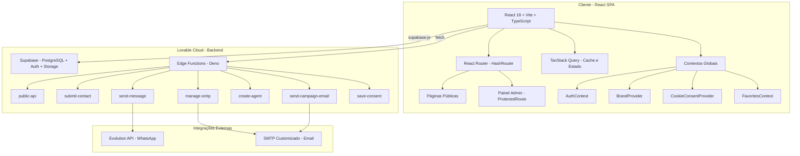

# Imobiliária Pro — Sistema de Gestão Imobiliária

Sistema completo de gestão imobiliária, construído como **multi-tenant**, onde você poderá gerenciar seus imóveis e agentes — tudo isolado por `tenant_id`.

---

## 📐 Arquitetura do Sistema



---

## 🛠 Tecnologias

| Camada      | Tecnologia                                                       |
| ----------- | ---------------------------------------------------------------- |
| Frontend    | React 18, TypeScript 5, Vite 5                                   |
| Estilização | Tailwind CSS 3, shadcn/ui, design tokens semânticos via HSL      |
| Estado      | TanStack React Query (cache), Context API (auth, brand, cookies) |
| Roteamento  | React Router DOM 6 (HashRouter)                                  |
| Backend     | Lovable Cloud (Supabase — PostgreSQL, Auth, Storage)             |
| Serverless  | Edge Functions (Deno runtime)                                    |
| Rich Text   | TipTap (editor de e-mails e blog)                                |
| Gráficos    | Recharts                                                         |
| Formulários | React Hook Form + Zod                                            |
| Tema        | next-themes (dark/light/system)                                  |

---

## 📂 Estrutura de Pastas

```
src/
├── components/
│   ├── admin/           # Componentes do painel administrativo
│   │   ├── BlogRichEditor.tsx   # Editor TipTap para blog
│   │   ├── BlogTagInput.tsx     # Seletor/criador de tags
│   │   ├── BrandCustomization.tsx # Identidade visual (gradiente, hero, logo)
│   │   ├── HeroBgCropper.tsx    # Crop visual da imagem do hero
│   │   ├── LogoCropper.tsx      # Crop do logo
│   │   ├── RichEmailEditor.tsx  # Editor de e-mails
│   │   └── ...
│   ├── agents/          # Card de agente
│   ├── auth/            # ProtectedRoute, PasswordInput
│   ├── cookie/          # Consentimento LGPD
│   ├── layout/          # Header, Footer, Layout, ScrollToTop
│   ├── properties/      # Cards, Lightbox, SearchBar, ContactForm
│   └── ui/              # shadcn/ui (button, dialog, table, etc.)
├── contexts/            # AuthContext, CookieConsent, Favorites
├── hooks/               # use-properties, use-tenant-settings, use-blog, etc.
├── lib/                 # Utilitários (format, share, youtube, utils)
├── pages/
│   ├── admin/           # Dashboard, Imóveis, Agentes, Config, Email, Blog
│   └── *.tsx            # Páginas públicas (Home, Login, Blog, Contato, etc.)
├── types/               # Tipagens (property.ts)
├── integrations/supabase/
│   ├── client.ts        # Cliente Supabase (auto-gerado, NÃO editar)
│   └── types.ts         # Tipos do banco (auto-gerado, NÃO editar)
└── index.css            # Design tokens (cores, fontes, sombras)

supabase/
└── functions/
    ├── public-api/      # Consultas públicas (imóveis, agentes, blog, stats)
    ├── submit-contact/  # CRUD de contatos, seed, busca
    ├── manage-smtp/     # Config SMTP, envio de e-mails, reset de senha
    ├── send-campaign-email/ # Disparos de campanhas de e-mail
    ├── create-agent/    # Criação de usuários/agentes (admin)
    ├── send-message/    # Envio WhatsApp via Evolution API
    └── save-consent/    # Registro LGPD de consentimento de cookies
```

---

## 🔐 Multi-Tenancy

Toda tabela do sistema possui a coluna `tenant_id`. As políticas RLS (Row Level Security) garantem que cada usuário acessa **somente** dados do seu tenant.

**Fluxo de criação de tenant:**

1. O primeiro usuário a se cadastrar recebe o papel `admin` e um tenant `default` é criado automaticamente (trigger `handle_new_user`).
2. Os demais usuários recebem o papel `user`.
3. Admins podem criar agentes via Edge Function `create-agent`.

**Funções de segurança no banco:**

- `get_user_tenant_id(user_id)` — retorna o `tenant_id` do usuário
- `has_role(user_id, role)` — verifica papel global
- `has_tenant_role(user_id, tenant_id, role)` — verifica papel dentro do tenant
- `check_rate_limit(...)` — rate limiting por IP/ação

---

## ⚡ Edge Functions

Todas as Edge Functions usam `verify_jwt = false` no deploy e validam autenticação **em código** quando necessário. Isso permite endpoints públicos e autenticados na mesma function.

| Função                | Autenticação | Descrição                                                |
| --------------------- | ------------ | -------------------------------------------------------- |
| `public-api`          | Nenhuma      | Listagem pública de imóveis, agentes, blog, tags e stats |
| `submit-contact`      | Mista        | Envio de contatos (público) + CRUD admin (autenticado)   |
| `manage-smtp`         | Autenticada  | Configuração SMTP, envio de e-mail teste, reset de senha |
| `send-campaign-email` | Autenticada  | Disparo de campanhas de e-mail em lote                   |
| `create-agent`        | Admin        | Criação de novos usuários com papel definido             |
| `send-message`        | Autenticada  | Envio de mensagens WhatsApp via Evolution API            |
| `save-consent`        | Nenhuma      | Registro de consentimento de cookies (LGPD)              |

**Ações da `public-api` para Blog:**

- `list-blog-posts` — lista posts publicados com paginação e filtro por tag
- `get-blog-post` — busca post por slug com autor e tags
- `list-blog-tags` — lista todas as tags disponíveis

**Padrão de chamada no frontend:**

```typescript
const PROJECT_ID = import.meta.env.VITE_SUPABASE_PROJECT_ID;
const res = await fetch(
  `https://${PROJECT_ID}.supabase.co/functions/v1/public-api?action=list-properties`,
);
```

> Nunca chamamos por caminho relativo (`/api/...`). Sempre URL completa com `PROJECT_ID`.

---

## 📝 Blog / Notícias

Sistema completo de blog multi-tenant com:

- **Editor Rich Text (TipTap)** — negrito, itálico, sublinhado, títulos (H1-H3), listas, citações, blocos de código, links, imagens inline, alinhamento de texto, desfazer/refazer
- **Tags / Categorias** — criação inline de tags no admin, filtro por tag na listagem pública
- **Upload de capa** — imagem de capa com upload para Storage
- **Publicação** — toggle rascunho/publicado com data de publicação automática
- **SEO-friendly** — slugs amigáveis gerados automaticamente a partir do título
- **Home** — seção "Últimas Notícias" com os 3 posts mais recentes
- **Página `/blog`** — listagem com paginação e filtro por tags
- **Página `/blog/:slug`** — detalhe do post com conteúdo HTML renderizado

---

## 🎨 Identidade Visual (Hero)

Configurações disponíveis no painel admin em **Identidade Visual**:

- **Modo do Hero** — alternar entre degradê (gradiente customizável) ou imagem de fundo
- **Crop visual** — arrastar e posicionar a imagem no retângulo do hero
- **Opacidade do overlay** — slider de 0% a 90% para ajuste fino da legibilidade do texto
- **Posição focal** — Topo, Centro ou Base para ajustar o enquadramento sem recortar
- **Logo** — upload com crop visual
- **Cores** — presets ou cores customizadas para primária e gradiente

---

## 📧 Configuração SMTP

O sistema permite que cada tenant configure seu **próprio servidor SMTP** para envio de e-mails (campanhas, reset de senha, notificações).

**Fluxo:**

1. Admin acessa `/admin/email` e preenche host, porta, usuário, senha, remetente.
2. A Edge Function `manage-smtp` salva os dados na tabela `smtp_settings`, com a senha ofuscada via XOR + base64 usando a `SERVICE_ROLE_KEY`.
3. Para envio, a função descriptografa a senha e envia via protocolo SMTP.
4. Rate limiting impede abuso: máx. 3 e-mails de teste por minuto por tenant.

**Ações da Edge Function `manage-smtp`:**

- `get-settings` — busca config SMTP do tenant
- `save-settings` — salva/atualiza config
- `test-email` — envia e-mail de teste
- `request-password-reset` — envia link de reset de senha
- `verify-reset-token` / `reset-password` — fluxo completo de reset

---

## 🏠 Fluxos Principais

### Visitante (público)

1. Acessa a home → vê imóveis destaques, agentes, estatísticas, últimas notícias
2. Busca imóveis com filtros (tipo, finalidade, preço, quartos, cidade)
3. Visualiza detalhes do imóvel com lightbox de fotos
4. Navega pelo blog com filtro por tags/categorias
5. Envia formulário de contato vinculado ao imóvel/agente
6. Aceita/rejeita cookies (LGPD)

### Admin

1. Login → redirect para `/admin`
2. Dashboard com métricas (imóveis, contatos, agentes)
3. CRUD de imóveis com upload de imagens, amenidades, geolocalização
4. Gerenciamento de agentes (criar via Edge Function)
5. **Blog** — criar/editar posts com editor rich text, tags, imagem de capa
6. Configurações do tenant: nome, cores, logo, hero (gradiente ou imagem), contato, redes sociais
7. Configuração SMTP e campanhas de e-mail
8. Envio de mensagens WhatsApp via Evolution API
9. Biblioteca de mídias

---

## 🚀 Como Rodar Localmente

### Pré-requisitos

- Node.js 18+
- npm ou bun
- Supabase CLI (para Edge Functions locais)

### Instalação

```bash
# Clonar o repositório
git clone <url-do-repo>
cd <nome-do-projeto>

# Instalar dependências
npm install

# Configurar variáveis de ambiente
cp .env_exemplo .env
# Editar .env com seus valores reais

# Rodar em dev
npm run dev
```

### Deploy de Edge Functions (Supabase CLI)

```bash
# Configurar o projeto
cp config_exemplo.toml supabase/config.toml
# Editar com seu project_id

# Login no Supabase
supabase login

# Deploy de todas as functions
supabase functions deploy public-api
supabase functions deploy submit-contact
supabase functions deploy manage-smtp
supabase functions deploy send-campaign-email
supabase functions deploy create-agent
supabase functions deploy send-message
supabase functions deploy save-consent
```

---

## 🔑 Variáveis de Ambiente

| Variável                        | Descrição                            |
| ------------------------------- | ------------------------------------ |
| `VITE_SUPABASE_PROJECT_ID`      | ID do projeto Supabase               |
| `VITE_SUPABASE_PUBLISHABLE_KEY` | Chave pública (anon key) do Supabase |
| `VITE_SUPABASE_URL`             | URL do projeto Supabase              |

> Secrets das Edge Functions (`SUPABASE_SERVICE_ROLE_KEY`, etc.) são gerenciados pelo Lovable Cloud e **nunca** devem ser expostos no frontend.

---

## 📊 Banco de Dados — Tabelas Principais

| Tabela                      | Descrição                                     |
| --------------------------- | --------------------------------------------- |
| `tenants`                   | Tenants (imobiliárias), com `settings` JSON   |
| `profiles`                  | Perfis de usuário vinculados a um tenant      |
| `user_roles`                | Papéis: `admin`, `agent`, `user`              |
| `properties`                | Imóveis com preço, localização, status        |
| `property_images`           | Fotos dos imóveis com ordenação               |
| `property_types`            | Tipos configuráveis (Casa, Apto, etc.)        |
| `property_amenities`        | Relação N:N imóvel ↔ amenidade                |
| `amenities`                 | Amenidades configuráveis por tenant           |
| `blog_posts`                | Posts do blog com conteúdo HTML rich text     |
| `blog_tags`                 | Tags/categorias para posts do blog            |
| `blog_post_tags`            | Relação N:N post ↔ tag                        |
| `contacts`                  | Leads/contatos recebidos                      |
| `messages`                  | Histórico de mensagens WhatsApp               |
| `smtp_settings`             | Configuração SMTP por tenant                  |
| `email_campaigns`           | Campanhas de e-mail                           |
| `email_campaign_recipients` | Destinatários e status de envio               |
| `media_library`             | Biblioteca de mídias do tenant                |
| `cookie_consents`           | Registros de consentimento LGPD               |
| `evolution_config`          | Config da Evolution API (WhatsApp) por tenant |
| `rate_limits`               | Controle de rate limiting                     |
| `password_reset_tokens`     | Tokens de reset de senha                      |

---

## ✅ Boas Práticas e Padrões

- **Design tokens semânticos** — todas as cores via CSS variables HSL (`--primary`, `--background`, etc.). Nunca usar cores hard-coded nos componentes.
- **RLS em tudo** — cada tabela tem Row Level Security ativo com políticas baseadas em `tenant_id`.
- **Validação server-side** — Edge Functions validam inputs; rate limiting em ações sensíveis.
- **Autenticação customizada** — `verify_jwt = false` nas functions; validação via `supabase.auth.getUser()` em código.
- **Componentes pequenos e focados** — shadcn/ui como base, componentes de negócio separados.
- **Cache inteligente** — TanStack Query com `staleTime` configurado por tipo de dado.
- **Multi-tenant first** — toda query filtra por `tenant_id`; nunca há acesso cross-tenant.
- **Branding dinâmico** — nome, cores, logo, textos vêm das configurações do tenant, sem valores hard-coded.
- **Conteúdo seguro** — HTML do blog sanitizado via TipTap; sem execução de scripts arbitrários.

---

## 📡 Integrações Externas

| Serviço       | Uso                                       | Configuração                          |
| ------------- | ----------------------------------------- | ------------------------------------- |
| Evolution API | Envio de mensagens WhatsApp               | `evolution_config` (base_url, apikey) |
| SMTP Custom   | E-mails de campanhas, reset, notificações | `smtp_settings` por tenant            |

---

## 🔗 Links Úteis & Tutoriais

Preparamos alguns materiais para te ajudar na jornada:

- 📺 [Guia de Setup do Projeto](https://youtu.be/NYizwEbWlHA)
- ☁️ [Como criar seu Projeto no Supabase](https://youtu.be/12ZPw-NmhZg)
- 🚀 [Deploy Supabase via CLI (Vídeo)](https://youtu.be/YTH2m8o7XOg)
- 📑 [Guia de Deploy (Documentação)](https://deploysupabaseviacli.lovable.app)

---

## 🌐 Compatibilidade de Hospedagem

O Quiz Builder foi desenvolvido para ser flexível e rodar em qualquer lugar:

- 🚀 **Vercel / Netlify / Cloudflare Pages:** Deploy otimizado.
- 💻 **Hospedagem Compartilhada:** Compatível (via Apache/cPanel).
- ☁️ **VPS:** Performance máxima.

---

## 🛠️ Configuração Local

1.  **Variáveis de Ambiente:**
    Crie/Configure o arquivo `.env`:

    ```env
    VITE_SUPABASE_PROJECT_ID=
    VITE_SUPABASE_PUBLISHABLE_KEY=
    VITE_SUPABASE_URL=
    ```

2.  **Supabase:**
    Configure o arquivo `config.toml` com o `project_id` do seu projeto.

3.  **Instalação:**
    ```bash
    npm install
    npm run dev
    ```

---

## Desabilitar verificação de e-mail no Supabase

Para desabilitar a verificação de e-mail no Supabase, siga os passos abaixo:

1. Acesse o dashboard do Supabase
2. Clique em Authentication
3. Clique em Settings
4. Desabilite a opção "Require email confirmation"

## 📦 Deploy

Para deploy em produção, recomendamos o uso do **Deploy Manager Pro** ou a integração nativa do Supabase CLI para uma experiência simplificada e segura.

<p align="center">
  Desenvolvido por <a href="https://afcode.com.br">afcode</a> com ❤️ para otimizar a gestão de imobiliárias.
</p>
